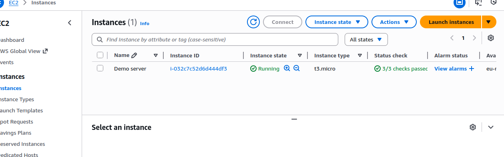
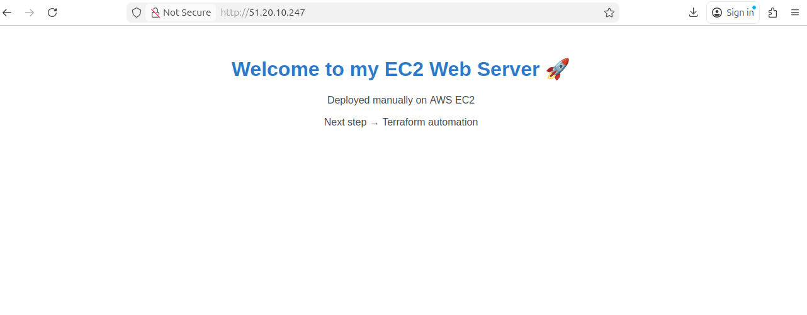
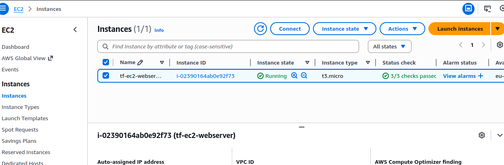
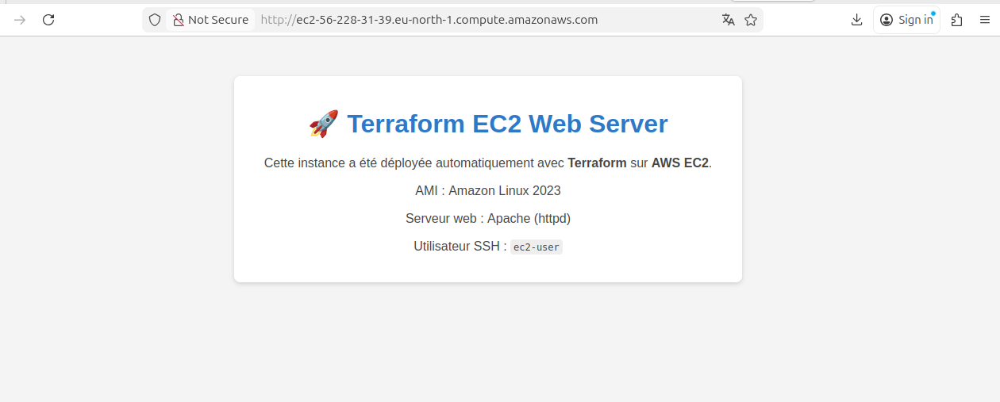

# 📘 **AWS EC2 Web Server — Manual Deployment & Terraform IaC**

## 🚀 Overview

This project demonstrates how to deploy a web server on **AWS EC2**, first manually using the AWS Console, then fully automated using **Infrastructure as Code (IaC)** with **Terraform**.

It highlights fundamental DevOps and Cloud Engineering skills:

* AWS EC2 provisioning
* Linux server configuration
* Web server setup (Apache HTTPD)
* Security Group configuration (SSH + HTTP)
* Terraform IaC (providers, resources, variables, outputs, user_data automation)

---

## 🛠️ **Architecture**

```
               ┌──────────────────────┐
               │      Terraform        │
               │  (IaC automation)     │
               └──────────┬───────────┘
                          │
                  Creates all AWS resources
                          │
        ┌─────────────────┴───────────────────┐
        │                                     │
┌────────────┐                       ┌─────────────────┐
│ Security   │                       │ EC2 Instance    │
│ Group      │                       │ Amazon Linux 2023│
│ SSH (22)   │                       │ User Data →      │
│ HTTP (80)  │                       │ Apache installed │
└────────────┘                       └─────────────────┘
```

---

## 📂 **Project Structure**

```
terraform-ec2-webserver/
├── main.tf            # EC2 + Security Group
├── variables.tf       # Input variables
├── outputs.tf         # Useful outputs (IP, DNS, SSH command)
├── user_data.sh       # Boot script (installs Apache + web page)
└── README.md
```

---

## 🧪 **Part 1 — Manual Deployment (AWS Console)**

1. Created an EC2 instance (Amazon Linux 2023)
2. Created and configured a Security Group (SSH + HTTP)
3. Connected using SSH with a `.pem` key
4. Installed Apache manually:

   ```bash
   sudo yum install httpd -y
   sudo systemctl start httpd
   sudo systemctl enable httpd
   ```
5. Deployed a test HTML page to `/var/www/html/index.html`

This allowed verifying the basic stack before automating everything.



---

## ⚙️ **Part 2 — Terraform Deployment (IaC)**

Automation includes:

* Security Group creation
* EC2 provisioning
* Fetching latest Amazon Linux AMI
* Automatic installation of Apache via `user_data.sh`
* Generating useful outputs (`public_ip`, `http_url`, `ssh_command`)

### Commands used

```bash
terraform init
terraform plan -var="key_name=First Key"
terraform apply -var="key_name=First Key"
```

### Result

Terraform automatically deploys:

* EC2 instance
* Apache web server
* Ready-to-use public URL
* SSH command

You can destroy everything cleanly:

```bash
terraform destroy -var="key_name=First Key"
```

---

## 🌐 **Final Result**

After deployment, the server is accessible at:

```
http://<public_dns>
```

And SSH access:

```bash
ssh -i "First Key.pem" ec2-user@<public_dns>
```



---

## 🔄 **Apache vs Nginx: What changes?**

If you wanted to use **Nginx instead of Apache**, only the `user_data.sh` would change.

### Current Apache version:

```bash
yum install -y httpd
systemctl enable httpd
systemctl start httpd
```

### Nginx version (for Amazon Linux 2023)

```bash
yum update -y
yum install -y nginx

systemctl enable nginx
systemctl start nginx
```

And the web root becomes:

```
/usr/share/nginx/html/index.html
```

So you would also update:

```bash
echo "Hello from Nginx" > /usr/share/nginx/html/index.html
```

This is literally **the only change**.
Everything else in Terraform stays exactly the same.

---

## 📌 **Skills Demonstrated**

* AWS Cloud fundamentals
* EC2 provisioning
* Linux administration
* Web server deployment
* Infrastructure as Code with Terraform
* User Data automation
* SSH key management
* Security Groups & networking
* Git & GitHub workflow

